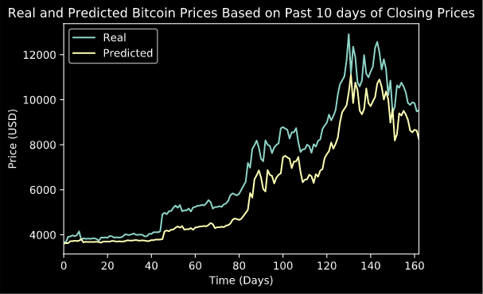
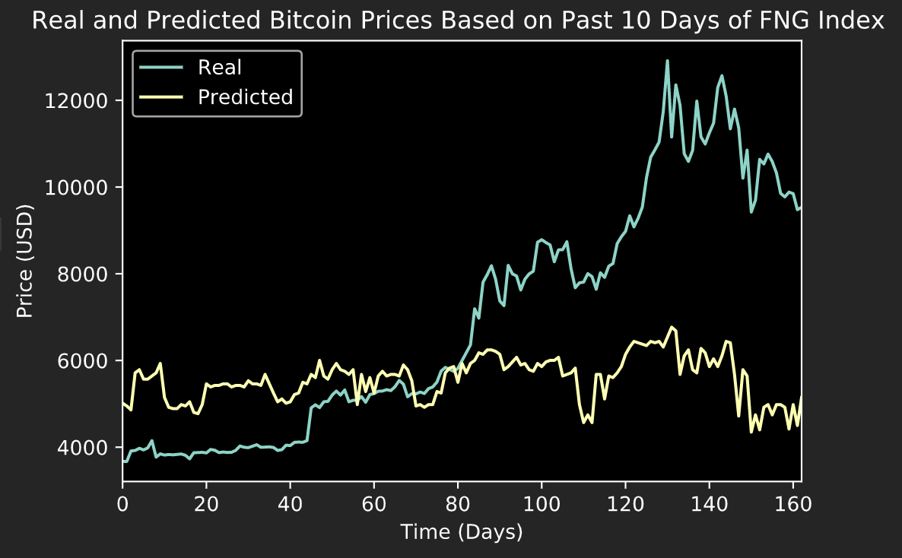

# deep_learning_hw

### LSTM RNN Analysis and Predicition of Bitcoin Prices

In this analysis, a dataset of BTC closing prices and fear and greed index was used to produce two LSTM RNN models. The models were trained on 70% of the data and tested on 30% of the data. One model was based on the previous 10 days of the closing price. The other model was based only on the FNG index from the past 10 days. When predicting price with the models, the model based on the past 10 days of closing prices was a much better and more accurate model than the model based on fear and greed index.

The following results were seen when plotting the actual and predicted prices for each model:

### LSTM RNN Model Based on Previous 10 Days of Closing Price

### LSTM RNN Model Based on Previous 10 Days of FNG Index

## Based on these plots and the resulting data the following questions can be addressed:

* Which model has a lower loss?

    The model based on closing prices had a loss of 0.0136. The model based on fng index had a loss of 0.0929. Thus, the model based on the closing prices had the lower losses. This makes sense when viewing the plots of the predicted vs actual BTC prices as the model based on closing prices more accurately predicts the actual values.

* Which model tracks the actual values better over time?

    Again, the model based on closing prices tracks the actual values better over time. In the plots you can see that the model based on closing price history is more similar and more tight fit to the actual prices. It would seem this is because this model is based on the actual historical price of BTC and not just on the emotional sentiment of the fear and greed index. That would be why the fng index based model does not do as well in its predictions of price and has a higher loss.

* Which window size works best for the model?

    After trying a few window sizes, it appears that a window size of 2 was a good option. 

    When going up to a window size of 6, predicted prices were less tight fit to the actual prices, less variable in price (looked more smooth), as well as not as accurate at predicting price. 

    Going down in window size allowed for more influence of the data in understanding the behavior of the price. 

    It appeared that at a window size of 2 the model was accurately predicting for the model based on closing prices really well. However, the model based on fng index was not becoming more accurate at predicting price at any window size. The lower window size did give that model more variations in price along the way (making it more jagged). 
    
    Overall, 2 seemed to be a good window size for accurately modeling the data without becoming to tightly fit or overtrained.